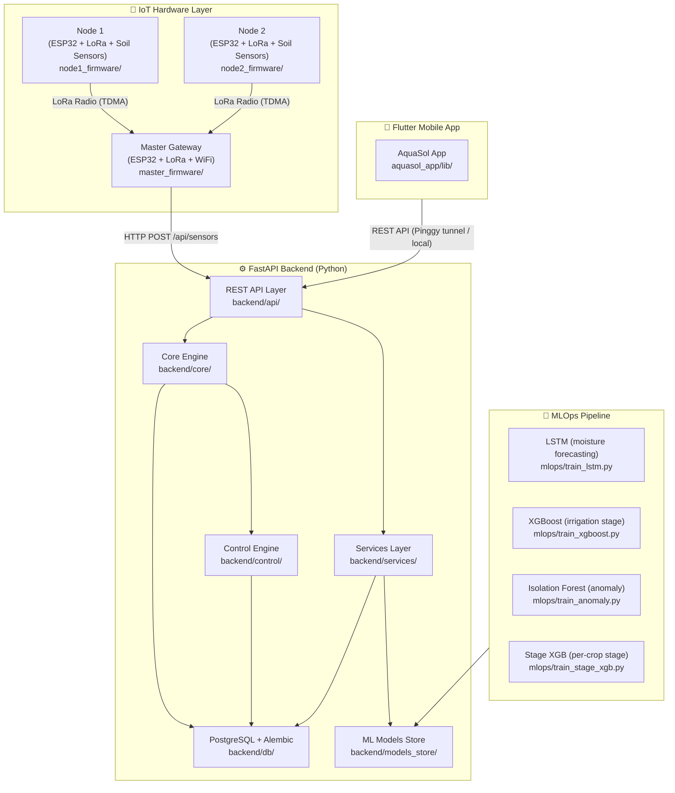
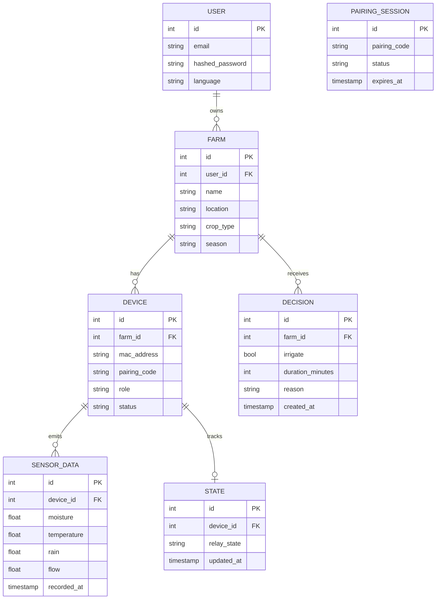
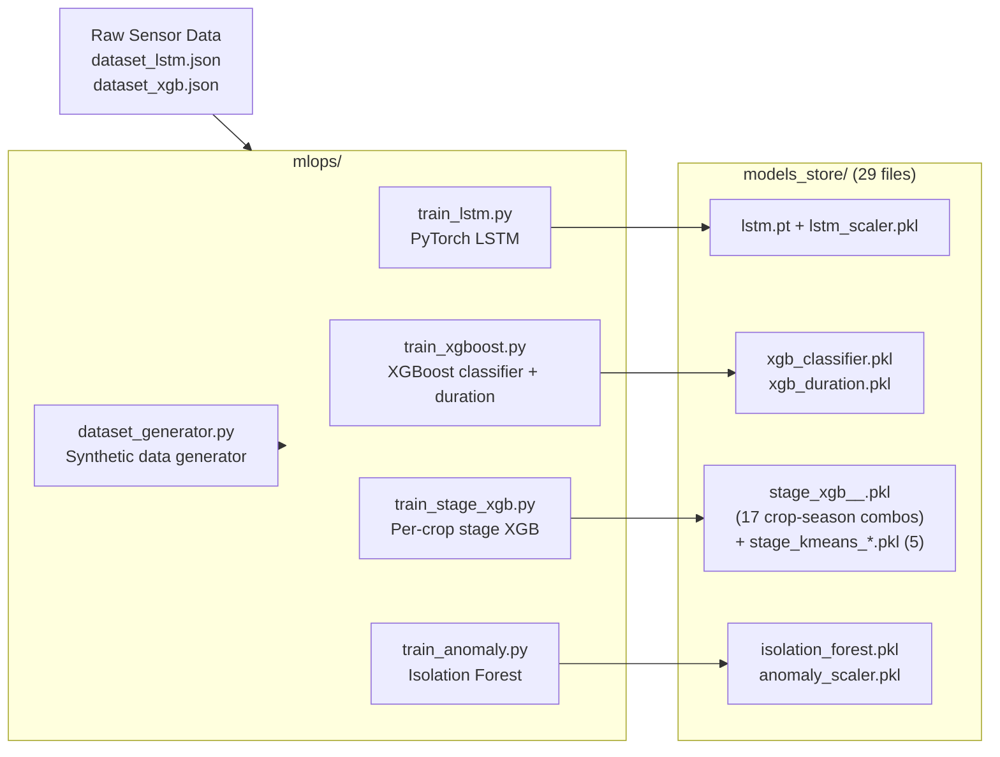
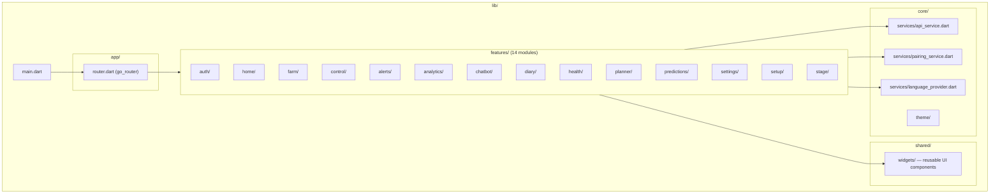
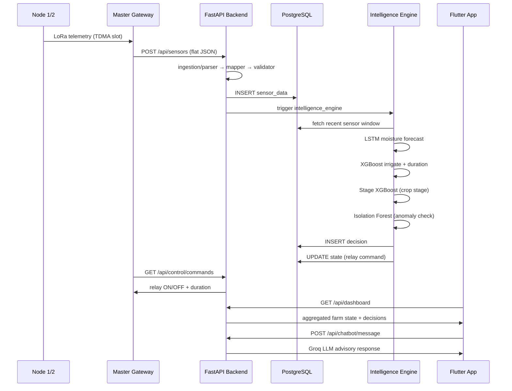

# AquaSol — Complete System Architecture

> **Project:** Smart Precision Irrigation Platform  
> **Stack:** ESP32 Firmware · FastAPI Backend · Flutter App · PyTorch/XGBoost MLOps  
> **Workspace:** `e:\Irrigation_api_V2`

---

## 1. System Overview



---

## 2. IoT Firmware Layer

| File | Role |
|------|------|
| `master_firmware/master_firmware.ino` | ESP32 Gateway — reads rain/flow sensors, collects node telemetry via LoRa TDMA, POSTs flat JSON to backend, drives relay outputs |
| `node1_firmware/node1_firmware.ino` | Node 1 — reads soil moisture/temperature, awaits LoRa time-slot, transmits telemetry to Master |
| `node2_firmware/node2_firmware.ino` | Node 2 — same role as Node 1, different MAC/pairing code |

**Key Firmware Concepts**
- **Pairing Code**: 6-char code derived from hardware MAC, displayed on LCD/OLED at boot for manual provisioning
- **TDMA Scheduling**: Master arbitrates time-slots to prevent LoRa collisions
- **WDT (Watchdog Timer)**: Prevents firmware lock-ups during radio wait states
- **Flat JSON Telemetry**: All sensors serialised in a single JSON payload per cycle

---

## 3. FastAPI Backend Layer

```mermaid
graph LR
    subgraph APP["app/"]
        MAIN["main.py — FastAPI app factory"]
        STARTUP["startup.py — lifespan hooks"]
        DEPS["dependencies.py — DI providers"]
    end

    subgraph API["api/ — Route Handlers"]
        auth["auth.py"]
        sensors["sensors.py"]
        dashboard["dashboard.py"]
        control["control.py"]
        device["device.py"]
        farm["farm.py"]
        pairing["pairing.py"]
        planner["planner.py"]
        reports["reports.py"]
        alerts["alerts.py"]
        chatbot["chatbot.py"]
        intelligence["intelligence.py"]
        stage["stage.py"]
    end

    subgraph CORE["core/ — Data Pipeline"]
        ingestion["ingestion/\nparser · mapper · validator"]
        aggregation["aggregation/\naggregator.py"]
        reliability["reliability/\nanomaly · trust · perception\nvirtual_sensing · control_loop\nml_supervisor"]
        spatial["spatial/\nroot_estimator.py"]
        state["state/\nstate_manager.py"]
    end

    subgraph CTRL["control/"]
        controller["controller.py"]
        failover["failover.py"]
        cmd_builder["command_builder.py"]
    end

    subgraph SVC["services/"]
        intelligence_engine["intelligence_engine.py\n(main AI orchestrator)"]
        advisory["advisory.py"]
        chatbot_svc["chatbot.py (Groq LLM)"]
        weather["weather.py"]
        alerts_svc["alerts.py"]
        diary_builder["diary_builder.py"]
        context_builder["context_builder.py"]
        health_monitor["health_monitor.py"]
        water_usage["water_usage.py"]
        i18n["i18n_service.py"]
    end

    subgraph DB["db/"]
        session["session.py — async SQLAlchemy"]
        base["base.py — declarative base"]
    end

    subgraph MODELS_ORM["models/ — ORM"]
        user_m["user.py"]
        farm_m["farm.py"]
        device_m["device.py"]
        sensor_m["sensor_data.py"]
        decision_m["decision.py"]
        state_m["state.py"]
        crop_m["crop.py"]
        pairing_m["pairing_session.py"]
        i18n_m["i18n.py"]
    end

    subgraph SCHEMAS["schemas/ — Pydantic"]
        auth_s["auth.py"]
        sensor_s["sensor.py"]
        dashboard_s["dashboard.py"]
        pairing_s["pairing.py"]
    end

    subgraph PLUGINS["plugins/"]
        ai_plugins["ai/ — AI plugin registry"]
        meta_plugins["meta/ — metadata plugins"]
    end

    MAIN --> API
    MAIN --> STARTUP
    API --> CORE
    API --> SVC
    API --> CTRL
    CORE --> DB
    SVC --> DB
    CTRL --> DB
    MODELS_ORM --> DB
```



### Backend Module Responsibilities

| Module | Responsibility |
|--------|---------------|
| `app/main.py` | FastAPI factory, mounts all routers, CORS |
| `app/startup.py` | Lifespan: DB init, model preload, background tasks |
| `core/ingestion/` | Parse → validate → map raw IoT JSON into ORM objects |
| `core/aggregation/` | Temporal aggregation of sensor windows |
| `core/reliability/` | Anomaly detection, sensor trust scoring, virtual sensing fallback, ML supervisor |
| `core/spatial/` | Root-zone depth estimation per crop |
| `core/state/` | In-memory device/zone state manager |
| `control/controller.py` | Decides irrigation ON/OFF per zone, writes commands to DB |
| `control/failover.py` | Failsafe rules when ML is unavailable |
| `services/intelligence_engine.py` | Orchestrates LSTM + XGBoost inference → irrigation decisions |
| `services/advisory.py` | Generates crop advisory messages |
| `services/chatbot.py` | Groq LLM chat with farm context |
| `services/weather.py` | External weather API integration |
| `services/diary_builder.py` | Daily farm diary generation |
| `plugins/ai/` | Pluggable AI provider registry |

---

## 4. Database Schema (ORM Models)



---

## 5. MLOps Pipeline



| Model | Algorithm | Purpose |
|-------|-----------|---------|
| `lstm.pt` | PyTorch LSTM | Predict next-timestep soil moisture |
| `xgb_classifier.pkl` | XGBoost | Binary irrigate/skip decision |
| `xgb_duration.pkl` | XGBoost | Predict irrigation duration (minutes) |
| `stage_xgb_<Crop>_<Season>.pkl` | XGBoost (17 variants) | Identify crop growth stage from sensor features |
| `stage_kmeans_*.pkl` | K-Means (5 variants) | Stage clustering fallback |
| `isolation_forest.pkl` | Isolation Forest | Sensor anomaly detection |

---

## 6. Flutter Mobile App



### Feature Module Map

| Feature | Screen Purpose |
|---------|---------------|
| `auth/` | Login / Register |
| `setup/` | Pairing code entry → device provisioning |
| `farm/` | Farm & zone management |
| `home/` | Dashboard overview |
| `control/` | Manual relay ON/OFF, zone control |
| `alerts/` | Push alert feed |
| `analytics/` | Sensor history charts |
| `predictions/` | LSTM moisture forecast display |
| `stage/` | Crop growth stage tracking |
| `planner/` | Irrigation schedule planner |
| `diary/` | AI-generated daily farm diary |
| `chatbot/` | Groq LLM farm advisor chat |
| `health/` | Device health / connectivity monitor |
| `settings/` | Language (i18n), account, preferences |

---

## 7. End-to-End Data Flow



---

## 8. Directory Reference

```
e:\Irrigation_api_V2\
├── main.py                         # Entry point (uvicorn)
├── requirements.txt
├── alembic/                        # DB migrations
│   └── versions/
├── backend/
│   ├── app/
│   │   ├── main.py                 # FastAPI factory
│   │   ├── startup.py
│   │   └── dependencies.py
│   ├── api/                        # 13 route modules
│   │   ├── auth.py · sensors.py · dashboard.py
│   │   ├── control.py · device.py · farm.py
│   │   ├── pairing.py · planner.py · reports.py
│   │   ├── alerts.py · chatbot.py · intelligence.py
│   │   └── stage.py
│   ├── core/
│   │   ├── ingestion/  (parser · mapper · validator)
│   │   ├── aggregation/ (aggregator)
│   │   ├── reliability/ (anomaly · trust · perception · virtual_sensing · control_loop · ml_supervisor)
│   │   ├── spatial/    (root_estimator)
│   │   └── state/      (state_manager)
│   ├── control/        (controller · failover · command_builder)
│   ├── services/       (13 service modules incl. intelligence_engine · chatbot · weather · advisory)
│   ├── models/         (9 SQLAlchemy ORM models)
│   ├── models_store/   (29 trained ML model files)
│   ├── schemas/        (4 Pydantic schema modules)
│   ├── db/             (session · base)
│   ├── config/         (settings.py)
│   └── plugins/        (ai/ · meta/)
├── mlops/
│   ├── train_lstm.py
│   ├── train_xgboost.py
│   ├── train_stage_xgb.py
│   ├── train_anomaly.py
│   └── dataset_generator.py
├── aquasol_app/                    # Flutter app
│   └── lib/
│       ├── main.dart
│       ├── app/router.dart
│       ├── core/services/          (api_service · pairing_service · language_provider)
│       ├── core/theme/
│       ├── shared/widgets/
│       └── features/               (14 feature modules)
│           ├── auth/ · home/ · farm/ · control/
│           ├── alerts/ · analytics/ · chatbot/ · diary/
│           ├── health/ · planner/ · predictions/
│           ├── settings/ · setup/ · stage/
├── master_firmware/master_firmware.ino
├── node1_firmware/node1_firmware.ino
└── node2_firmware/node2_firmware.ino
```
